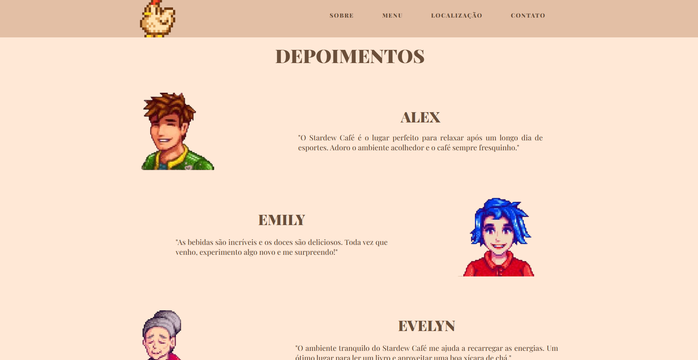

# Website Stardew Café

---

## 📌 Descrição

Este projeto é um **website estático** feito para uma cafeteria fictícia inspirada no universo do jogo **"Stardew Valley"**, chamada **Stardew Café**.
O site se propõe a ser uma **página de apresentação da cafeteria**, com informações sobre o cardápio, localização, contato, e outras funcionalidades relacionadas. Esta webpage foi **criada como um "desafio pessoal de código"** elaborado por mim e outros colegas do curso de **Análise e Desenvolvimento de Sistemas**, visto que estávamos iniciando nossos estudos em **HTML e CSS** com hospedagem no **GitHub** e tínhamos muito interesse em fixar conceitos desenvolvidos durante as aulas.

Ainda que o projeto seja simples (e com alguns problemas visuais), ele é muito especial para mim, pois marcou o início da minha jornada como desenvolvedor.

---

## 🚀 Tecnologias

**HTML • CSS • Google Fonts**

---

## 🎯 Objetivo

O projeto foi desenvolvido para **praticar, reforçar e aprimorar habilidades em desenvolvimento web**.

---

## 📸 Demonstração

---

## 🌐 Acesse o Projeto

  

